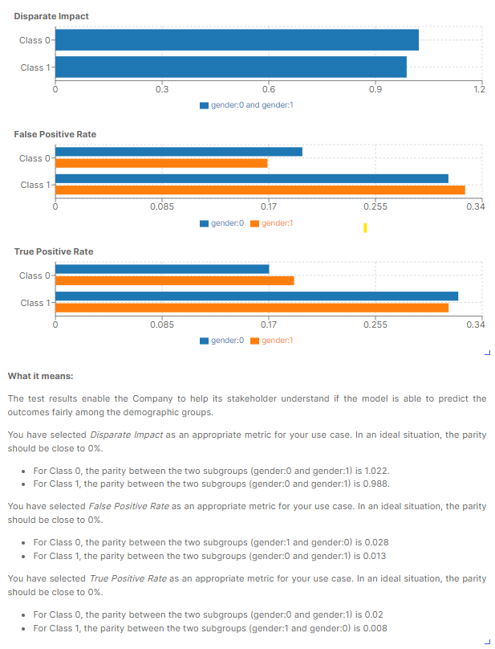

# Fairness Metrics Toolbox for Classification

## Description

The Fairness Metrics Toolbox (FMT) for Classification contains a list of fairness metrics to measure how resources (e.g. opportunities, food, loan, medical help) are allocated among the demographic groups (e.g. married male, married female) given a set of sensitive feature(s) (e.g. gender, marital status). This plugin is developed for classification models.

## Plugin contents
- Algorithms
  
| Name                                        | Description                                                                                                                                                                                                                                                                                                                                                             |
| ------------------------------------------- | ----------------------------------------------------------------------------------------------------------------------------------------------------------------------------------------------------------------------------------------------------------------------------------------------------------------------------------------------------------------------- |
| Fairness Metrics Toolbox for Classification | This algorithm computes a list of fairness metrics to measure how correctly your model predicts among the given set of sensitive features.   Fairness metrics include: False Negative Rate Parity, False Positive Rate Parity, False Discovery Rate Parity, False Omission Rate Parity, True Positive Rate Parity, True Negative Rate Parity, Positive Predictive Value Parity, Negative Predictive Value Parity  |

- Widgets

| Name                      | Description                                                                          |
| ------------------------- | ------------------------------------------------------------------------------------ |
| Bar Chart (Selected)      | To generate bar chart(s) for the selected fairness metric(s) from the fairness tree |
| Interpretation (Selected) | To provide interpretation for the selected fairness metric(s) from the fairness tree   |
| Description (Summary)     | To provide an introduction to the Fairness Metrics Toolbox for Classification        |
| Interpretation (Summary)  | To provide interpretation and recommendations to the results                          |
| Table of Definition       | To provide a table of definitions for all the fairness metrics calculated            |
| Fairness Metrics (All)    | To generate all fairness metrics                                                     |

## Using the Plugin in AI Verify
### Data Preparation
- Tabular dataset ([Tutorial for Preparation](www.test.com))

### Algorithm User Input(s)

|      Input Field       |            Description            |  Type   |
| -------------------- | ------------------------------- | :-----: |
| Sensitive Feature Name | Array of sensitive features names   You may select multiple sensitive features of interest, and as a guide these are usually demographic features | `array` |

### Algorithm Input Block - Fairness Tree
The Fairness Tree helps you to select the most relevant fairness metrics for your use case. Read more on how to use the fairness tree [here](/docs/how_to/use_fairness_tree.md) 

### Sample use of the widgets

